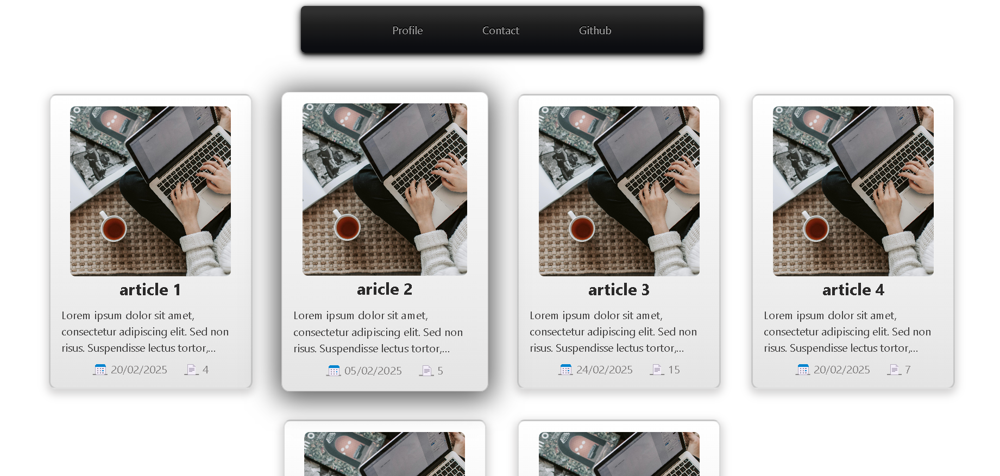
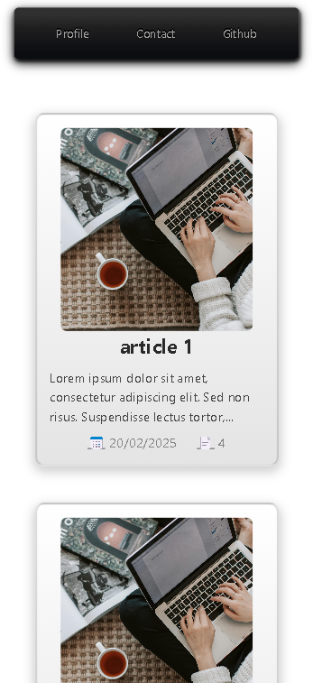
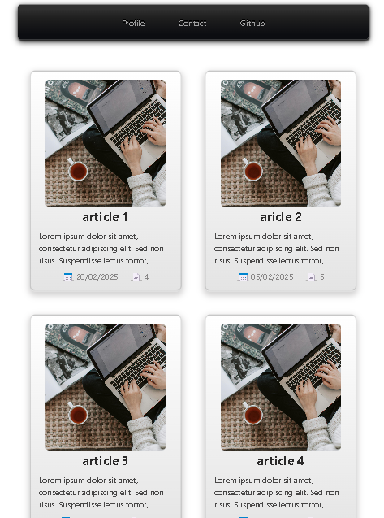

# Angular Articles App

## Web, Mobile, and Tablette Main page view





This is a fully responsive Angular 19 application designed to display articles fetched from a Laravel backend. The app features a clean and user-friendly interface with a list of articles shown in a stylish card layout. Each card is clickable, allowing users to view more details of the selected article. The app also includes a Navbar and Footer, providing a seamless navigation to the sources or contact.

## Features

- **Responsive Design:** The app is designed to be fully responsive, ensuring it works seamlessly across different screen sizes (desktop, tablet, mobile).
- **Article Listing:** The main page fetches a list of articles from the Laravel API and displays them in a beautiful card layout.
- **Article Details:** Clicking on any article card shows more detailed information, such as the article's title, description, and other metadata.
- **Navigation:** The app includes a reusable Navbar and Footer component that are displayed across the app.
- **Integration with Laravel API:** The app interacts with two endpoints from a Laravel backend:
  - `GET http://localhost:4200/articles` - Fetches a list of articles.
  - `GET http://localhost:4200/articles/{id}` - Fetches details of a specific article by its ID.

## Project Structure

```bash
src/
├── app/
│   ├── articles/ : Module for managing articles-related features
│   │   ├── articles-list/ : Component to list and display articles
│   │   │   ├── articles-list.component.ts : Handles logic for fetching and displaying articles
│   │   │   ├── articles-list.component.spec.ts : Unit tests for ArticlesListComponent
│   │   │   ├── articles-list.component.html : HTML template for the articles list
│   │   │   ├── articles-list.component.css : Styles specific to ArticlesListComponent
│   │   ├── model/ : Defines data models for the application
│   │   │   └── article.ts : Article model definition (id, title, content, etc.)
│   │   ├── service/ : Services for handling business logic and API requests
│   │   │   └── articles.service.spec.ts : Unit tests for ArticlesService
│   │   │   └── articles.service.ts : Provides methods to fetch and manage articles from the backend
│   │   ├── articles-routing.module.ts : Defines routes for the ArticlesModule
│   │   ├── articles.module.ts : Configuration and declarations for the ArticlesModule
│   ├── navbar/ : Component for the navigation bar
│   │   └── navbar.component.ts : Logic for handling navigation links
│   ├── footer/ : Component for the application footer
│   │   └── footer.component.ts : Handles footer display logic
│   ├── app.component.css : Styles for the root application component
│   ├── app.component.spec : Unit tests for AppComponent
│   ├── app.component.html : Root template integrating Navbar, Footer, and router outlet
│   ├── app.component.ts : Main application component logic
│   ├── app.config.ts : Configuration file for app-level constants
│   ├── app.routes.ts : Defines application-level routes
├── index.html : Main HTML file that bootstraps the Angular application
├── assets/ : Directory for static assets like images
│   └── images/ : Contains image resources
│       └── logoSC.png : Application logo
│       └── cardImage.png : Placeholder image for article cards

```

### Key Components

- **Articles Module:**
  - **ArticlesList Component:** Displays a list of articles in cards. Each card shows the article's title and description, and is clickable to open the article details page.
  - **Articles Service:** Handles API requests to the Laravel backend to fetch articles and article details.

- **AppModule:**
  - **Navbar Component:** Provides the navigation links for the app.
  - **Footer Component:** Displays footer information across the app.

### Responsive Design

- The app is designed with **CSS** and **TypeScript**, using a mobile-first approach to ensure a seamless user experience across devices. The layout adjusts dynamically based on the screen size, with a grid system to handle multiple columns on larger screens and a single column on smaller screens.

## Endpoints

The application interacts with two GET endpoints from the Laravel backend:

1. **GET /articles**: Fetches a list of all articles.
2. **GET /articles/{id}**: Fetches a specific article by its ID.

### Example API Response

#### `/articles`

```json
[
{
  "id": "1",
  "Title": "Article1",
  "Image": "image.jpg",
  "HeaderImage": "header.jpg",
  "Introduction": "This is an introduction.",
  "Description": "This is a description.",
  "Language": "en",
  "KeyWords": "sample, article",
  "State": 1,
  "NumVisit": 0,
  "IdTheme": 1,
  "IdUser": 1,
  "IdHost": 1
},
{
  "id": "2",
  "Title": "Article2",
  "Image": "image.jpg",
  "HeaderImage": "header.jpg",
  "Introduction": "This is an introduction.",
  "Description": "This is a description.",
  "Language": "en",
  "KeyWords": "sample, article",
  "State": 1,
  "NumVisit": 0,
  "IdTheme": 1,
  "IdUser": 1,
  "IdHost": 1
}
]
```

#### `/articles/{id}`

```json
{
  "id": "2",
  "Title": "Article2",
  "Image": "image.jpg",
  "HeaderImage": "header.jpg",
  "Introduction": "This is an introduction.",
  "Description": "This is a description.",
  "Language": "en",
  "KeyWords": "sample, article",
  "State": 1,
  "NumVisit": 0,
  "IdTheme": 1,
  "IdUser": 1,
  "IdHost": 1
}
```

## Installation

Clone the repository:

bash
Copy
Edit
git clone https://github.com/Smart-Conseil-PFE-Test/Angular_Application.git

cd angular-articles-app
Install dependencies:

bash
Copy
Edit
npm install
Start the development server:

bash
Copy
Edit
ng serve
Navigate to http://localhost:4200 in your browser to see the app in action.

Technologies Used
Angular 19: Frontend framework for building dynamic, single-page applications.
TypeScript: Type-safe JavaScript for better code quality.
CSS: Custom styles for a responsive and modern UI.
Laravel API: Backend providing articles data (using GET endpoints).
RxJS: For handling asynchronous operations and HTTP requests.

## Contributing

Feel free to fork the repository and create a pull request if you would like to contribute. Please ensure your changes don't break the current functionality.

License
This project is licensed under the MIT License - see the LICENSE file for details.

Thank you for reviewing my work! If you have any questions or feedback, feel free to reach out.

markdown
Copy
Edit

### Key Points

- **Project Overview**: A quick, clear summary of the app's purpose and core functionality.
- **Features**: A list of the app's most important features, emphasizing user experience and technology used.
- **Responsive Design**: Highlighting the mobile-first, responsive layout.
- **Endpoints**: Clarifying how the app interacts with the Laravel backend and providing sample responses.
- **Installation & Setup**: Clear steps to clone and run the app.
- **Technologies Used**: Lists key technologies that demonstrate your technical skills.
- **License**: Basic legal information.

This `README.md` structure demonstrates the project’s key features and development process clearly, which would help potential recruiters see your skills in Angular, TypeScript, and frontend development.
